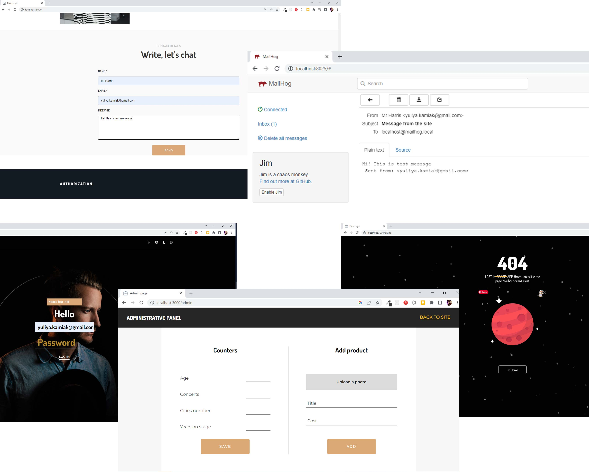

# nodejs-express-landing-login-admin

## The project has the following scripts:

Running the application in production mode

```bash
    npm start
```

Running the app in development mode

```bash
    npm run start:dev
```

Perform code formatting

```bash
    npm run prettier
```

Perform code review with Eslint

```bash
    npm run lint
```

Perform code review with Eslint and autocorrection

```bash
    npm run lint:fix
```

## The project consists of three routes

- `/` - main landing
- `/login` - admin panel login form
- `/admin` - admin panel

## Implemented

### On the home page

---

POST Request URL: `/`
Sends fields to the server

```
    {
      name,
      email,
      message
    }
```

Sends an email from the user.

On the main page, the output of skills and products comes from the database. That is, if a product is added in the administrative panel, then it should appear in the search results on the main page. If skill values were changed in the admin panel, they should also be changed on the main page.
### On the login page

---

POST Request URL: `/login`
Sends fields to the server

```
    {
      email,
      password
    }
```

This is the login form for the admin panel. If the email and password match the saved one, then we skip to the admin page, otherwise we don’t let it in with a message why.
### On the admin page

---

POST Request URL: `/admin/upload`

The FormData object is sent to the server with a picture of the product and a description. We save the picture of the product and its description in the database
```
    in the photo field - Product picture
    in the name field - Product name
    in the price field - Product price
```

---

POST Request URL = `/admin/skills`

An object with fields is sent to the server with the skill value. Skills update their values in the database
```
    {
        age - 'Violin start age'
        concerts - 'The violinist played the concerts'
        cities - 'Maximum number of cities in the tour'
        years - 'Years on stage as a violinist'
    }
```

As a database, the data is stored on the server in a JSON file from [LowDB](https://github.com/typicode/lowdb)

Each form has a `.status` field for responses from the server. To send responses from the server there, the [connect-flash] package (https://www.npmjs.com/package/connect-flash) is used
### Email sending and receiving
For testing email sending and receiving please use Mailhog https://github.com/mailhog/MailHog/releases

Run asset from link above or from `/mailhog` folder and then the SMTP server starts on port 1025 and the HTTP server starts on port 8025.
Visit localhost:8025 or 127.0.0.1:8025 in your web browser to see the MailHog Web UI.

